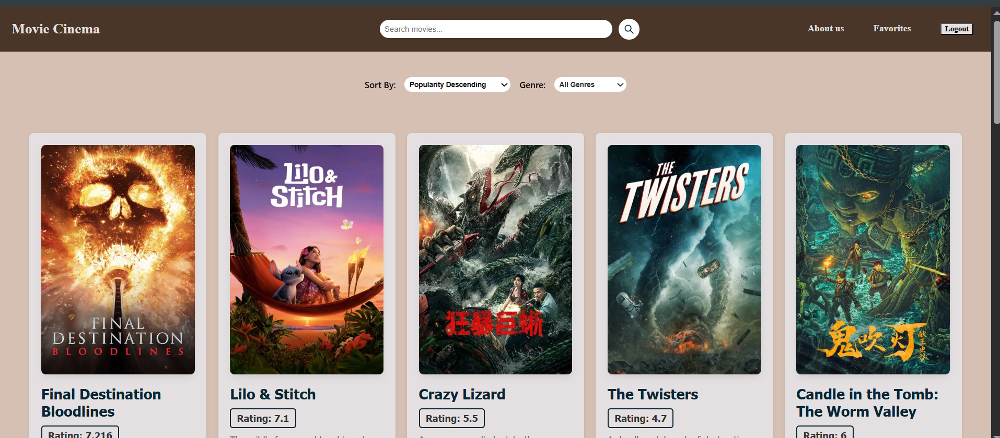

# 🎬 MovieCinema App

MovieCinema is a sleek and modern React web application that allows users to explore, search, and manage their favorite movies. Designed with a clean and responsive UI, it integrates with [TMDb (The Movie Database)](https://www.themoviedb.org/) API to bring real-time movie data to users.

 <!-- Optional: add a screenshot link -->

---

## 🚀 Features

- 🔍 **Search Movies** by title
- 🎭 **Filter by Genre**
- 📊 **Sort** by popularity, rating, or release date
- ❤️ **Add/Remove Favorites**
- 📄 **View Full Movie Details**
- 🔐 **Login/Signup** with styled auth pages
- 🧾 **About Page** styled like Netflix/Amazon Prime

---

## 🛠 Tech Stack

- **Frontend**: React, React Router, Axios
- **Styling**: CSS (custom theme), Flexbox, Responsive Design
- **Icons**: react-icons
- **API**: [TMDb API](https://developer.themoviedb.org/)

---

## 📦 Installation

1. **Clone the repo**

```bash
git clone https://github.com/ehsan-2423/EAD_Project.git
cd EAD_Project
````

2. **Install dependencies**

```bash
npm install
```

3. **Start the app**

```bash
npm run dev  # or npm start if using CRA
```

4. **Set up environment**

Update your API key from [TMDb](https://www.themoviedb.org/) inside your API calls or store it in `.env`:

```env
VITE_TMDB_API_KEY='0fa2853e7c4d6c8f146aba861c5e4a06'
```

---

## 📁 Folder Structure

```
src/
├── components/
│   ├── MovieApp.js
│   ├── MovieDetails.js
│   ├── About.js
│   ├── Footer.js
│   └── LoginContext.js
├── ComponentStyling/
│   ├── MovieApp.css
│   ├── MovieDetails.css
│   ├── About.css
│   └── Signup.css
├── App.js
└── main.jsx
```

---

## 📸 UI Preview

* 🔐 Auth: Custom themed Signup/Login pages
* 🏠 Home: Movie list with poster, rating, and filters
* 📄 About: Netflix-style modern sectioned info page
* ❤️ Favorites: Manage a personalized list of favorite movies

---

## 🤝 Contributing

Contributions are welcome!
Feel free to open issues or submit pull requests.

---

## 📄 License

This project is open source under the [MIT License](LICENSE).

---

## 👨‍💻 Developer

**Ehsan Hussain**
Frontend & Full Stack Developer
[LinkedIn](https://linkedin.com/in/ehsan-hussain-3b91612b0/) | [GitHub](https://github.com/ehsan-2423)


